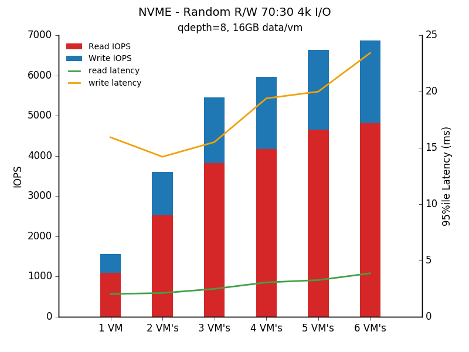

# fio-tools
This project contains some tools to make measuring performance with fio a little easier when working with gluster and ovirt. The goal is to use fio to benchmark latencies within vm's and then use the fio results as input to matplotlib.pylot, to simplify the interpretation of the results.  
  

## Pre-Requisites  
+ Use a node to act as the test controller - this can be your desktop
+ clone this repo to your controller node
+ your controller will need python2-matplotlib,python2-numpy, nmap-ncat
+ have passwordless ssh setup between your controller and the test vm's  
+ have passwordless ssh setup between your controller and the gluster nodes
+ ensure fio is installed on your controller and each vm (*NB. use the same versions!*)
+ on each vm install, enable and start the fio-server.service (from this repo's systemd directory)  
+ ensure that port 8765 is open on each vm
+ the output directory needs to exist on each client

### Tested Versions
RHEL7 - fio 2.1.7 from Dag Wiers repo (http://rpm.pbone.net/index.php3/stat/4/idpl/26433361/dir/redhat_el_7/com/fio-2.1.7-1.el7.rf.x86_64.rpm.html)

NB. testing with fio versions 2.2.8-1 and 2.2.8-2 from EPEL are prone to intermittent crc issues. 

## Workflow
For best results, evenly distribute the vm's across the hypervisors  
  
The repo is split into two main steps; run the workload -> summarise the workload, with a pretty chart :)

### Running the workload
From the root of the repository
1. ```cd controller```
2. update run-workload.yml, defining your gluster hosts and clients (vm's)
3. create an fio job file (some examples are provided in the repo)
4. execute the run-workload.sh script  
```markdown
e.g
./run-workload.sh -j randrw7030.job -t ssd_data -r 120 -q 8 
```
In the above example, the randrw7030.job is sent to all defined clients, which are backed by the gluster volume called 'ssd_data'. Overrides for qdepth and runtime are provided allowing the fio job file to be standard across different runs.  
By default, the workload is be run in a 'cumulative' manner(stepped), increasing the number of concurrent vm's executing the fio workload, one by one. You can use the -m immediate parameter if you just want to see the results for a single iteration of a given number of clients (as defined in run-workload.yaml).

Output is generated to a default 'output' sub-directory, or you may specify the -o option to direct it to another location. The output directory will hold;  
+ the fio json files from each client
+ a copy of the actual fio job file used (after the runtime changes are made)
+ a copy of the volume configuration (vol info)
+ gluster vol profiles for each test cycle [optional if you use the -s parameter]

### Interpreting the Output
Once the run is complete, you can use the json data to create a chart
1. cd ```../reporting```
2. run the gencharts.py program to create the chart from the json data (-p points to the path location of the fio json files - normally the same dir as the -o option used by run-workload.sh)
```markdown
./genchart.py -p ~/Downloads/7030_4 -t "NVME - Random R/W 70:30 4k I/O" \
 -s "qdepth=8, 16GB data/vm" -o output/myfile.png
```  
3. genchart.py will create a csv dump of the summary data, and also provide a chart that plots read and write i/o latencies against the IOPS for the different densities of vm's. 

eg.
```markdown
[paul@work reporting]$ ./genchart.py -p ~/Downloads/7030_4 -t "NVME - Random R/W 70:30 4k I/O" -s "qdepth=8, 16GB data/vm" -o output/myfile.png
processing file /home/paul/Downloads/7030_4/randrw7030.job_ssd_data_001_json.out
processing file /home/paul/Downloads/7030_4/randrw7030.job_ssd_data_002_json.out
processing file /home/paul/Downloads/7030_4/randrw7030.job_ssd_data_003_json.out
processing file /home/paul/Downloads/7030_4/randrw7030.job_ssd_data_004_json.out
processing file /home/paul/Downloads/7030_4/randrw7030.job_ssd_data_005_json.out
processing file /home/paul/Downloads/7030_4/randrw7030.job_ssd_data_006_json.out

title, NVME - Random R/W 70:30 4k I/O
subtitle, qdepth=8, 16GB data/vm
xaxis labels,1 VM,2 VM's,3 VM's,4 VM's,5 VM's,6 VM's
read iops,1091,2524,3818,4176,4646,4806
write iops,468,1081,1635,1791,1995,2067
read latency (μs),2024,2112,2480,3056,3260,3861
write latency (μs),15936,14208,15509,19392,19993,23424

```

By default 'genchart' will launch a window showing you the graph.  
eg.



### Script Options
The complete workflow revolves around just two scripts; `run-workload.sh` and `gencharts.py`. This section documents the options that may be used with these scripts.

```
run-workload.sh
---------------

Script to run a given fio workload against a number of 
clients running fio daemons

Options
        -j .... filename which contains the fio job parameters (REQUIRED)
        -t .... target volume name (REQUIRED)
        -f .... configuration file name (default is 'run-workload.yaml')
        -m .... mode to run, 'stepped' (default) or immediate. 
                - stepped ramps up the workload one client at a time
                - immediate starts the workload on all clients at once
        -s .... turn on gluster vol profile for the run (default is off)
        -d .... debug - do nothing except echo actions to the console
        -q .... override the qdepth in the job file for this run
        -r .... override the runtime defined (secs)
        -n .... override the number of fio processes/client for this run
        -h .... display help and exit
        -o .... output directory for fio json files etc
 
```  

The options available when generating the I/O summary chart are;
```markdown
[paul@work reporting]$ ./genchart.py -h
Usage: genchart.py [options]

Options:
  --version             show program's version number and exit
  -h, --help            show this help message and exit
  -D, --debug           turn on debug output
  -p FIO_FILE_PATH, --pathname=FIO_FILE_PATH
                        file name/path containing fio json output
  -t TITLE, --title=TITLE
                        Chart title
  -s SUBTITLE, --subtitle=SUBTITLE
                        Chart subtitle
  -o OUTPUT_FILE, --output=OUTPUT_FILE
                        output filename

```


Have fun testing!